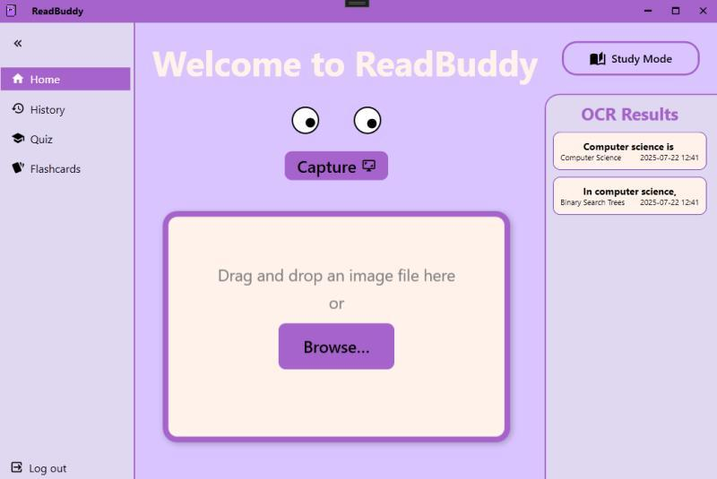
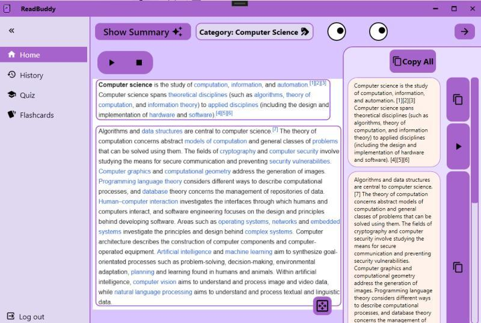
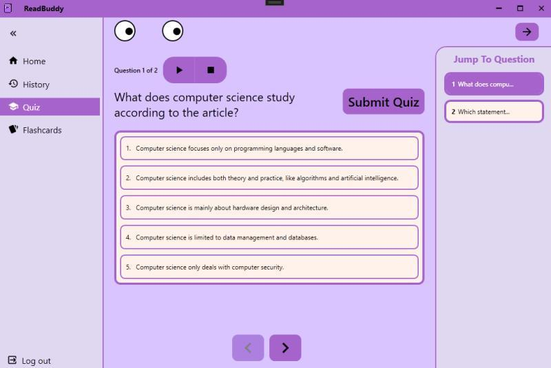
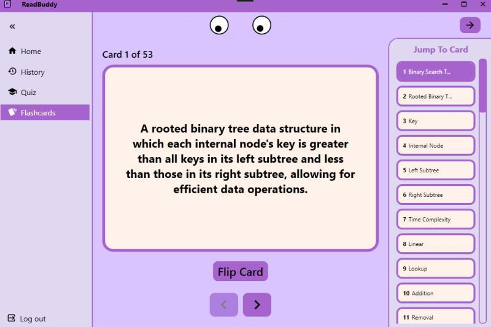

# ReadBuddy 📚

An AI-powered reading assistant designed for users with ADHD, dyslexia, and other learning disabilities. Capture text from the screen, extract, analyze, and read it aloud—plus AI-powered summarization for better comprehension.

## 🌟 Features

- **🖼️ Screen Capture & OCR**: Capture text from any screen using advanced OCR technology
- **🗣️ Text-to-Speech**: High-quality voice synthesis for reading aloud
- **📄 AI Summarization**: Intelligent document summarization for better comprehension
- **🎯 Interactive Quizzes**: Generate quizzes from extracted text to test understanding
- **📚 Glossary Creation**: Automatically create glossaries from complex documents
- **🔊 Audio Export**: Export summaries and content as audio files
- **🌐 Multi-language Support**: Support for multiple languages and text analysis
- **♿ Accessibility Focused**: Designed specifically for users with learning disabilities

## 📸 Application Screenshots

### Home Screen
Upload or capture text from any source. ReadBuddy extracts text using OCR and stores previous scans for quick access.



### Smart Reading & Summarization
View extracted content, generate AI-powered summaries, and listen to text using built-in text-to-speech.



### Interactive Quiz Generation
Automatically generate quizzes from the extracted content to reinforce understanding and improve retention.



### Flashcards & Study Mode
Convert extracted concepts into flashcards for active recall and spaced repetition learning.



## 🏗️ Architecture

ReadBuddy follows a modern three-tier architecture:

```
┌─────────────────────────────────────────────────────────┐
│                   Frontend (WPF)                        │
│              Windows Desktop Application                │
└─────────────────────────────────────────────────────────┘
                              │
                              ▼
┌─────────────────────────────────────────────────────────┐
│                  Backend (FastAPI)                      │
│        REST API with Celery Task Queue                  │
└─────────────────────────────────────────────────────────┘
                              │
                              ▼
┌─────────────────────────────────────────────────────────┐
│              External Services                          │
│    Azure Cognitive Services, OpenAI, MongoDB           │
└─────────────────────────────────────────────────────────┘
```

## 🚀 Quick Start

### Prerequisites

- **Windows 10/11** (for WPF frontend)
- **Python 3.8+** (for backend)
- **Visual Studio 2022** (for frontend development)
- **Docker** (optional, for containerized backend)
- **MongoDB** (local or cloud instance)
- **Redis** (for task queue)

### 1. Backend Setup

```powershell
cd backend
.\start-backend.ps1
```

This will automatically:
- Create virtual environment
- Install dependencies
- Start Redis container
- Launch Celery worker
- Start FastAPI server

### 2. Frontend Setup

```powershell
cd frontend/ReadBuddy
# Open in Visual Studio 2022
ReadBuddy.sln
```

### 3. Test the Application

```powershell
cd test_client
.\setup_and_run_tests.ps1
```

## 📂 Project Structure

```
ReadBuddy/
├── 📁 backend/              # FastAPI backend server
│   ├── 🐍 app/             # Application code
│   │   ├── 📁 models/      # Data models
│   │   ├── 📁 routes/      # API endpoints
│   │   ├── 📁 services/    # Business logic
│   │   ├── 📁 tasks/       # Celery tasks
│   │   └── 📁 utils/       # Utility functions
│   ├── 🗄️ database/        # Database interface
│   ├── 🐳 docker/          # Docker configuration
│   └── 📋 requirements.txt # Python dependencies
├── 📁 frontend/            # WPF desktop application
│   └── 📁 ReadBuddy/       # WPF project
│       ├── 📁 Models/      # Data models
│       ├── 📁 ViewModels/  # MVVM view models
│       ├── 📁 Views/       # UI views
│       ├── 📁 Services/    # Service layer
│       └── 📁 Themes/      # UI themes
├── 📁 test_client/         # Integration tests
│   ├── 🧪 Test scripts     # Automated test suite
│   └── 📷 images/          # Test images
└── 📄 README.md           # This file
```

